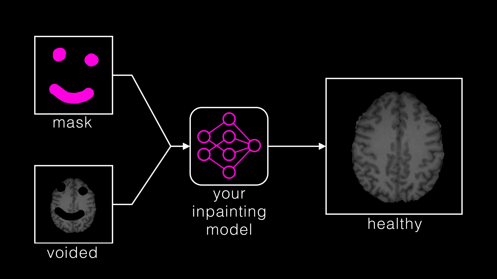

# inpainting

Official package to compute metrics for the [BraTS inpainting challenge](https://x.com/BraTS_inpaint).

## Installation

```bash
pip install inpainting
```

## Usage

The package provides `generate_metrics` to evaluate inpainting quality, and `read_nifti_to_tensor` to load NIfTI images as tensors.

```python
from inpainting.challenge_metrics_2023 import generate_metrics, read_nifti_to_tensor


def compute_image_quality_metrics(
    prediction: str,
    healthy_mask: str,
    reference_t1: str,
    voided_t1: str,
) -> dict:
    prediction_data = read_nifti_to_tensor(prediction)
    healthy_mask_data = read_nifti_to_tensor(healthy_mask).bool()
    reference_t1_data = read_nifti_to_tensor(reference_t1)
    voided_t1_data = read_nifti_to_tensor(voided_t1)

    metrics = generate_metrics(
        prediction=prediction_data,
        target=reference_t1_data,
        normalization_tensor=voided_t1_data,
        mask=healthy_mask_data,
    )

    return metrics
```

### Computed Metrics

`generate_metrics` returns a dictionary containing the following image quality metrics, computed over the inpainted (masked) region after percentile-based normalization to [0, 1]:

| Key | Description |
|---|---|
| `ssim` | Structural Similarity Index (SSIM) |
| `mse` | Mean Squared Error |
| `rmse` | Root Mean Squared Error |
| `msle` | Mean Squared Logarithmic Error |
| `mae` | Mean Absolute Error |
| `psnr` | Peak Signal-to-Noise Ratio (data range derived from input) |
| `psnr_eps` | PSNR with epsilon for numerical stability |
| `psnr_01` | PSNR with fixed data range [0, 1] |
| `psnr_01_eps` | PSNR with fixed data range [0, 1] and epsilon |

## Citation
Please cite our [manuscript](https://arxiv.org/pdf/2305.08992.pdf) when using the package:
```
@misc{kofler2023brain,
      title={The Brain Tumor Segmentation (BraTS) Challenge 2023: Local Synthesis of Healthy Brain Tissue via Inpainting}, 
      author={Florian Kofler and Felix Meissen and Felix Steinbauer and Robert Graf and Eva Oswald and Ezequiel de da Rosa and Hongwei Bran Li and Ujjwal Baid and Florian Hoelzl and Oezguen Turgut and Izabela Horvath and Diana Waldmannstetter and Christina Bukas and Maruf Adewole and Syed Muhammad Anwar and Anastasia Janas and Anahita Fathi Kazerooni and Dominic LaBella and Ahmed W Moawad and Keyvan Farahani and James Eddy and Timothy Bergquist and Verena Chung and Russell Takeshi Shinohara and Farouk Dako and Walter Wiggins and Zachary Reitman and Chunhao Wang and Xinyang Liu and Zhifan Jiang and Ariana Familiar and Gian-Marco Conte and Elaine Johanson and Zeke Meier and Christos Davatzikos and John Freymann and Justin Kirby and Michel Bilello and Hassan M Fathallah-Shaykh and Roland Wiest and Jan Kirschke and Rivka R Colen and Aikaterini Kotrotsou and Pamela Lamontagne and Daniel Marcus and Mikhail Milchenko and Arash Nazeri and Marc-André Weber and Abhishek Mahajan and Suyash Mohan and John Mongan and Christopher Hess and Soonmee Cha and Javier Villanueva-Meyer and Errol Colak and Priscila Crivellaro and Andras Jakab and Jake Albrecht and Udunna Anazodo and Mariam Aboian and Juan Eugenio Iglesias and Koen Van Leemput and Spyridon Bakas and Daniel Rueckert and Benedikt Wiestler and Ivan Ezhov and Marie Piraud and Bjoern Menze},
      year={2023},
      eprint={2305.08992},
      archivePrefix={arXiv},
      primaryClass={eess.IV}
}
```
